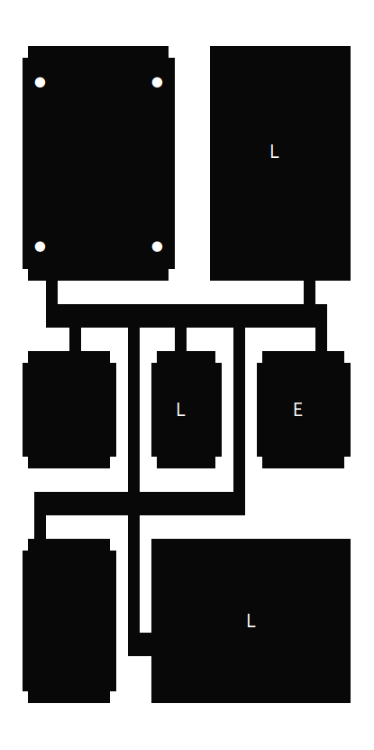
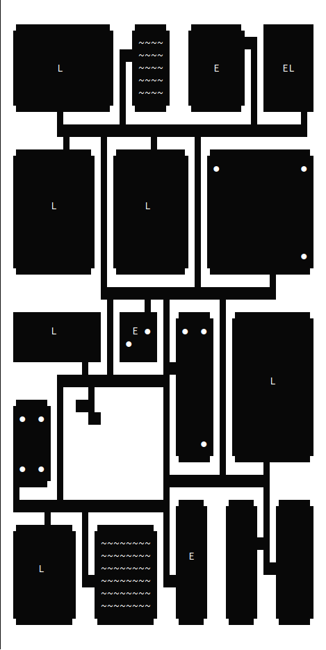

# Donjun
A dungeon generator, but since there are so many of them called "Dungen", this one just sounds like it.

## Usage
To install Donjun, clone the repository and use `dotnet` to compile:
```
git clone https://github.com/xiaoxiae/Donjun.git
cd Donjun
dotnet build -c Release
```

The binary can now be found in `bin/Release/...`. To run, simply do `./Donjun`, possibly with a `--help` parameter to see possible options.

## Examples

### 30 by 30



### 50 by 50



